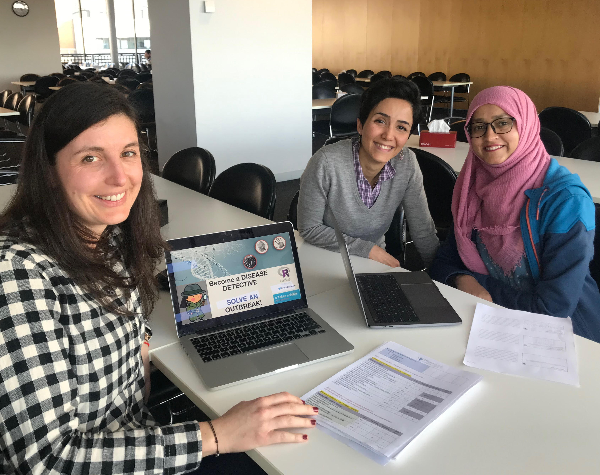
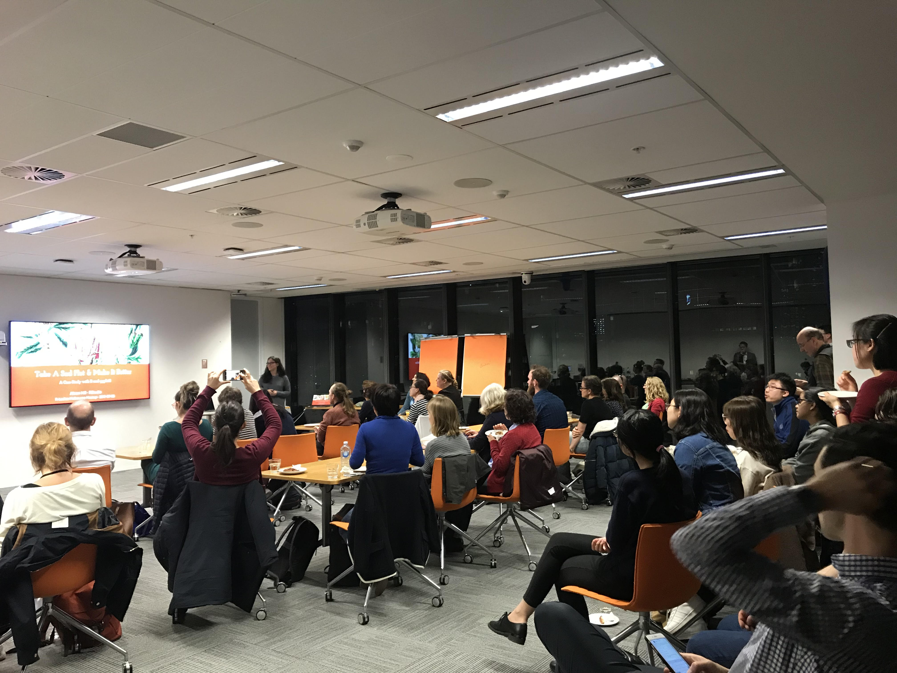
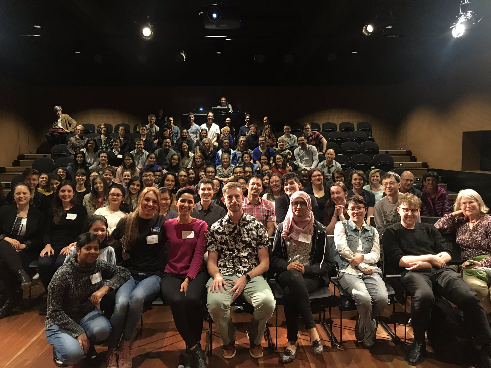
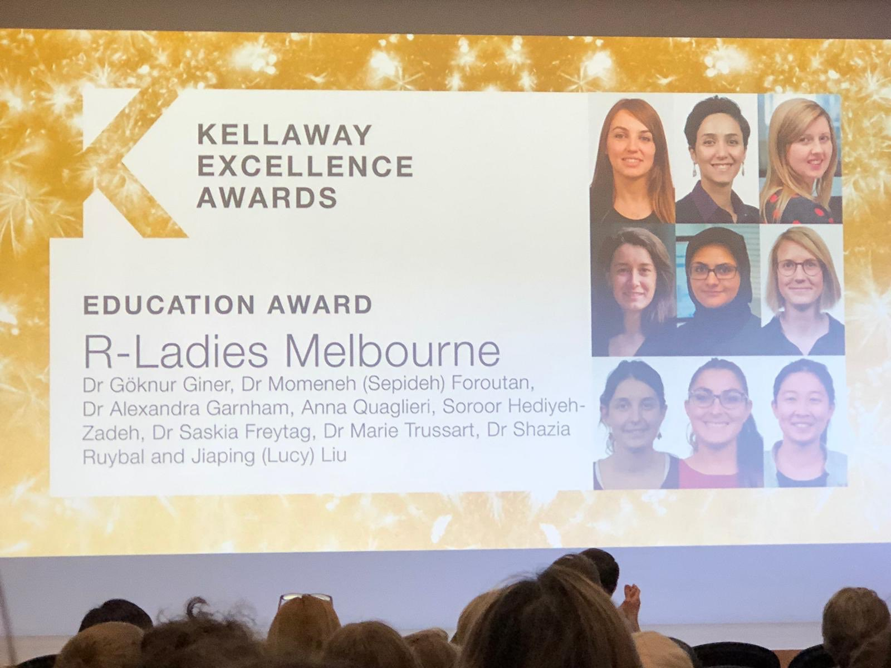
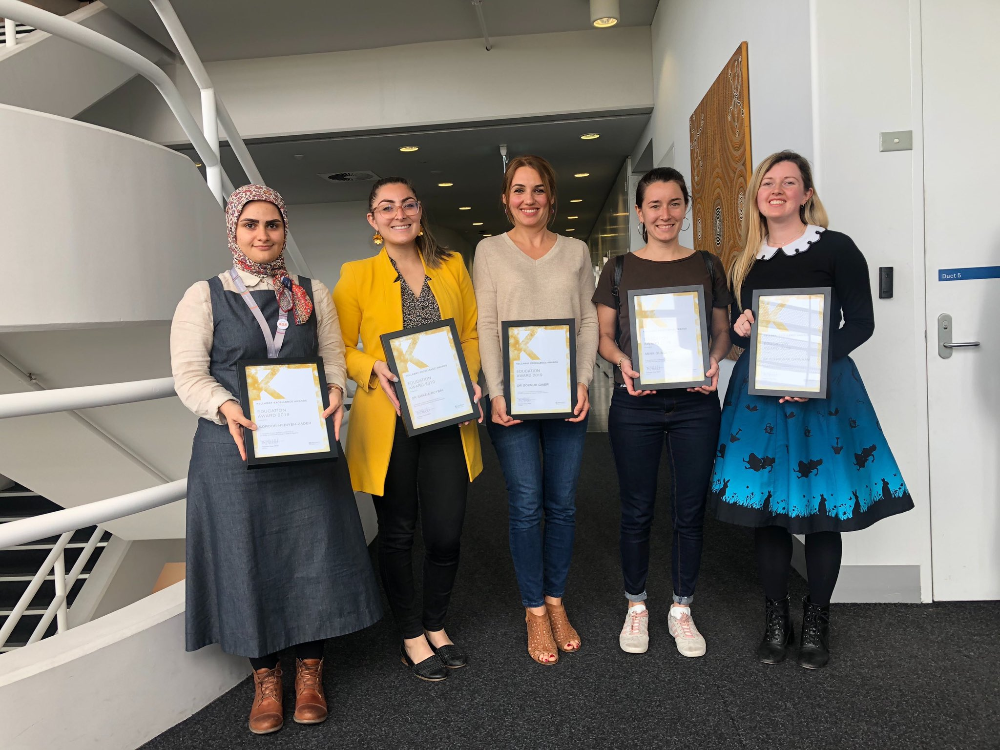

```{r setup, include=FALSE}
knitr::opts_chunk$set(echo = FALSE)
library(magick)
library(png)
library(grid)
# library(emo)
# library(icon)
```

# Recap
As we mentioned [before](https://rladiesmelb2018.netlify.com), the R-Ladies Melb chapter was founded as the first R-Ladies chapter in Australia in Sep 2016. We are glad that today, there are five more chapters in Australia, including [Sydney](), [Brisbane](), [Canberra](), [Adelide]() and [Perth](). R-Ladies Melb has always had a main organiser for every year. Although we were not much formally shaped in 2017, [Goknur Giner]() did a great job for organising most of the things, so she was our informal main organiser at the time. In 2018, [Anna Quaglieri] was selected more formally by all of us agreeing in our committee meeting for her to be the main organiser. Finally in 2019, it was my turn to do it by everyone's agreement. We are extremely happy to have has growing number of members in our local community, which has now > 1300 members. [SEPIDEH ADD LINK TO MEET UP]

# We are now a registered not-for-profit!
As briefly mentioned [before](https://r-ladiesmelbourne-team.netlify.com), we started to learn about how to become an incoporated association in late 2018. With many helps from different members of the team, specifically [Lucy Liu]() who left Australia in April (?) 2019, we registered the **R-Ladies Melb Inc** in March 2019. This required us to define official roles, specifically for President, vice-presidet, treasurer and secretory. After that we started learning how to open a bank account for incorporation and how to keep track of our expenses more formally. A lot of these were done by [Adele Barugahare]() who became our Treasurer and [Marie Trussart](), who was selected for being Vice-president in mid 2019 after our initial Vice-president, [Nikki Rubinstein](), stepped down from that role due to other committment. I also became the President of R-Ladies Melb Inc. 
```{r}
## Photo of registration
```

In addition to this official roles, each of us, as always, has had internal roles, for example for social media, catering, flyer, etc.

# Organisers of R-Ladies Melb Inc
SEPIDE TO ADD THE ORGANISERS' PHOTO when they provide it.
Sepideh Foroutan 
Marie Trussart
Adele Barugahare
Goknur Giner
Alexander Garnham
Anna Quaglieri
Sehrish Kanwal
Shazia Ruybal
Nikki Rubinstein
Miriam Yeung
Shanmathi Ramasubbu

We also had occasional help from Koo (last name?).
```{r}
# photo of organisers
```

In 2019-2020 we were able to organise X events covering x workshops, x seminars and x networking.

**Question: As it is going to be also the repot for the incorporation, should we only cover March 2019 to March 2020?**

# Encouraging high school girls
The R-Ladies Meln Inc was lucky to be able to attend “It takes a spark” conference, where we tought and encouraged high school girls to develop interest in STEAM (Science, Technology, Engineering, Arts, Math) by showing them how to explore an epidemic disease in R.

**Question: which photo is better?**
```{r, echo=FALSE, fig.cap=" preparation for it takes a spark conference",echo=FALSE, fig.align="center", out.width = '65%'}

```


# MoRe advanced R:
Although we organised a workshop to teach the fundamentals of R (by **Goknur Giner** and **Nikki Rubinstein**) and a lunch Zoom event on basic data visualisation in R (by **Tobey Zhang**), this year we focused more on the advanced topics; this was because the majority of our members were interested in advanced R topics, according to our 2019 start-of-the-year survey. Examples of these events are:\n

* RMarkdown and publication-ready documents by **Anna Quglieri** and **Soroor Hediyeh Zadeh** in Feb
*	Overview of Reproducible research, documentation, and cloud computing by **Lavinia Gordon** in May
*	Natural language processing from **Ana Mamatelashvili** in June
*	Package review system and rOpenSci from **Melina Vidoni** in July
*	Reproducibility using Containers in R by **Saras Windecker** in Sep


# Speakers straight from the RStudio:
This year, we have been extremely luckly to have two speakers from the RStudio. In Sep 2019, **Alison Hill** showed us how to take a bad plot and make it better! 
```{r, echo=FALSE, fig.cap="The R-Ladies Melb Inc event with Alison Hill",echo=FALSE, fig.align="center", out.width = '65%'}

```

**Di Cook** has been supported us all along the way. Mid 2019 she let us know that Hadley will be in Melb and we invited him straight away! Hadley's talk focused on designing data science. 
```{r, echo=FALSE, fig.cap="The R-Ladies Melb Inc event with Hadley Wickham",echo=FALSE, fig.align="center", out.width = '65%'}

```


It was not surprising that for this event we had 130 attendees and many people in the waiting list. That is why we live-streamed the event so that other people could attend too. It was exciting to see on twitter that we had even audience from far distances, such as Brazil (SEPIDEH TO ADD A PHOTO FOR THIS)


# Education award from WEHI
```{r, echo=FALSE, fig.cap="Receiving the Education award from WEHI",echo=FALSE, fig.align="center", out.width = '65%'}


```


# Sponsors:
```{r, echo=FALSE, fig.cap="Amazing view from the venue provided by our amazing sponsor, NOUS",echo=FALSE, fig.align="center", out.width = '65%'}
knitr::include_graphics("./photos/NOUS.jpg")
```
CSL
NOUS
Zendek
R Consurtium
etc

Also maybe make some comments about this https://qz.com/work/1661486/r-ladies-made-data-science-inclusive/


[R-Ladies](https://rladies.org/) is a world-wide organisation founded in San Francisco by [Gabriela de Queiroz](https://k-roz.com/) with the aim of promoting gender diversity within the [`r icon::fa_r_project(colour="#88398A")`](https://www.r-project.org/) community.

 Since then, new groups have started in Adelaide, Sydney and Canberra!

# Where are we at?

Time flies, and it’s already been two years since our launch event. And just as a holiday ends and recollections of all the best moments begin to take form in your mind (can’t really think of any bad one!), I decided to take some time to collect the pieces of a special year for the Aussie R and R-Ladies community.

We celebrated our first anniversary a little over a year ago, and reached nearly 600 members on Meetup. In 2018 we celebrated again on the 17th of October and reached over 1000 members! We continued to host monthly events from February to December, and couldn’t really be happier with the consistently strong participation at our events across the year. Of course, we can’t claim that we ordinarily would attract 500 members at a given event (we would really need to have hired a bigger space…) but the steady increase in member turnout over the year is a reminder to us that this group is still needed and continues to attract more interest!


```{r fig.cap="Fig1. New members on meetup and events from October 2017 to October 2018.", echo = FALSE,fig.asp=0.60}
img <- readPNG("AllPhotos/time_series.png")
grid.raster(img)
```

<br>
  
```{r fig.cap="Fig2. Speakers from November 2017 to October 2018", echo = FALSE,fig.asp=0.50}
img <- readPNG("AllPhotos/faces2018.png")
grid.raster(img)
```


You can find all the materials produced and used across these two past years at our GitHub repository https://github.com/R-LadiesMelbourne/Links-to-Events-Repos and find videos of seminars at our R-Ladies Melbourne YouTube channel.

<br>
